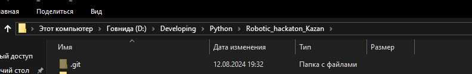
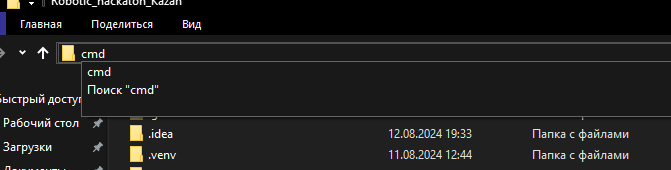

# Robotic_hackaton_Kazan
Проект команды "Robotic" для участия в хакатоне "Kazan Digital Transformation"


# Гайд по запуски Бэка у себя на компьютере

1. Установить [Python версии 3.11.9](https://www.python.org/downloads/release/python-3119/) ([для Win 64-бит](https://www.python.org/ftp/python/3.11.9/python-3.11.9-amd64.exe))
2. Открыть папку бэка
3. В проводнике в строке пути написать ```cmd```




4. Далее прописать следующие команды для активации виртуального пространства 
(чтобы не поломать зависимости в компьютере)
   * ```python -m venv venv```
   * ```venv\Scripts\activate.bat```
   * 
5. Далее устанавливаем зависимости для работы (FastApi и тп)
    * ```pip install requirements.txt```
6. Запускаем сервер (тестовый, для работы не пригодится)
    * ```unicorn src.main:app --reload```
7. Переходим на сайт http://127.0.0.1:8000 (или тот, что у вас появился в терминале)

P.S:
1. Для выключения сервера в терминале нажмите сочетание клавиш ```Ctrl``` + ```C``` и закрывайте терминал
2. Для просмотра документации по бэку (доступные endpoints / routers) 
перейдите на страницу документации http://127.0.0.1:8000/docs. Может долго грузится